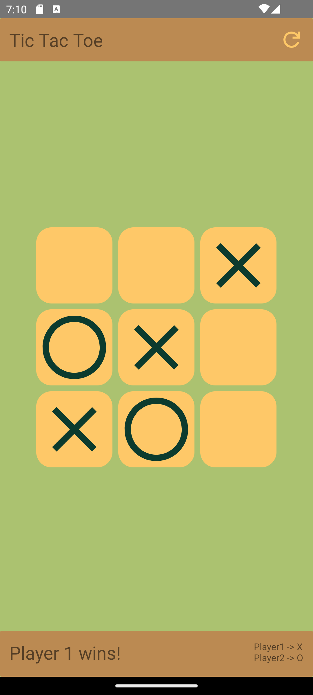
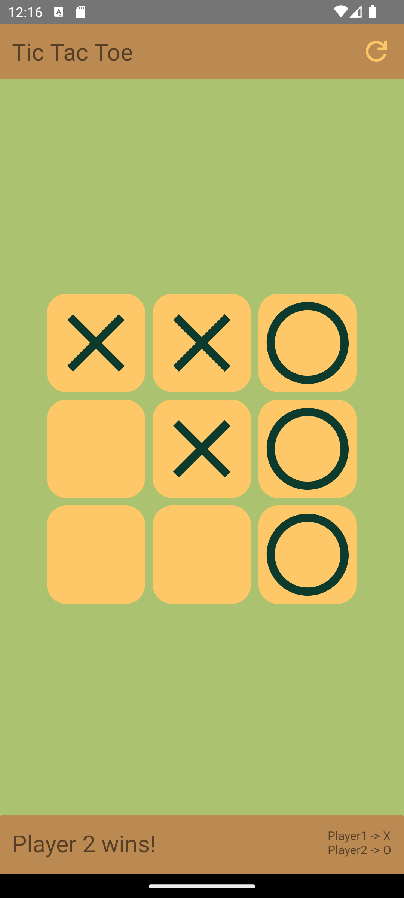
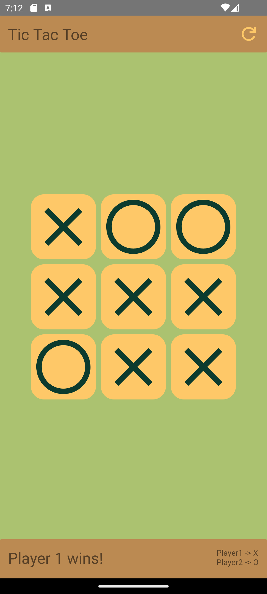

# Tic-Tac-Toe Android App

This simple Tic Tac Toe Android application allows users to play the classic game of Tic Tac Toe on their Android devices. 
The app is built using Java and utilizes drawables and a **grid layout** to provide an intuitive interface for an enjoyable gaming experience.

## Features
 1. Play Tic Tac Toe against a friend on the same device.
 2. Simple and intuitive user interface.
 3. Clear indication of game status and winner.
 4. Reset option to start a new game.

## Screenshots
  
